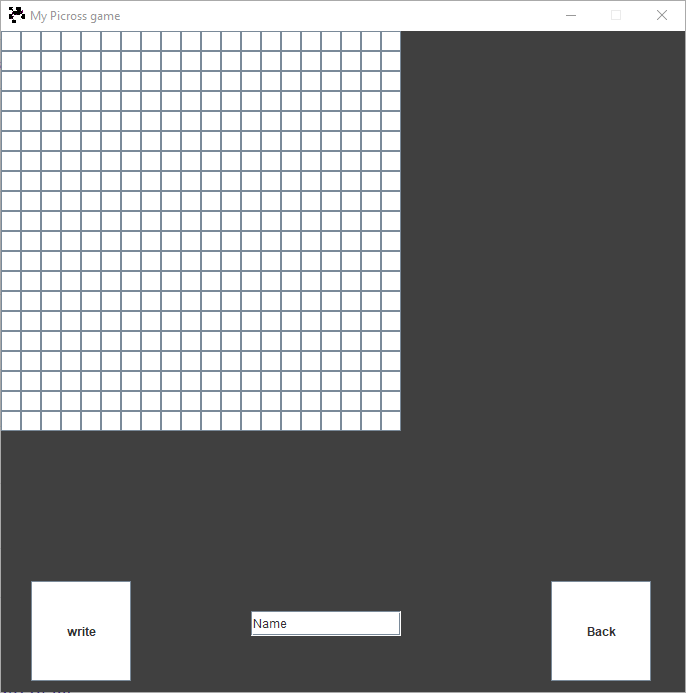

# Picross_Java_Gui

 This is my java projet for school. The purpose is to make a java picross with many lvls and a lvl editor and maby differents theme if i can and have the time !
 It work with jkd 11 and 14 (I didn't test with older versions)

## Functionnalities

 * A playable picross game
 * level editor

## Difficulties

  There are 3 levels of difficulty :

  * Easy
  * Medium
  * Hard

  The concept of difficulty is based on the size of the grid
  Easy mode is 10 by 10
  Medium is 15 by 15
  Hard is 20 by 20

## Color themes

  The choice of the color theme is not yet implemented

## Level editor

  You can chose the difficulty (the size) of the grid
  and then create your beautiful black and white pixel
  art and name it how ever you want

 

## Preview

### Menu

 

### Choice of level

 

### Game

 

### Level editor

   

##How to test

You can simply create a new projet in your favorite IDE
and import my sources from my github (like in intelliJ or Eclipse)
Or launch my .jar file in the root folder if this work on your system configuration
